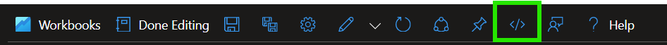

# Azure Service Retirement Resources

The workbook in this directory contains the colletion of Azure Resources Graph queries in this repository. 

To deploy the workbook, follow these steps:

1. From the Azure portal, navigate to [Azure Monitor](https://ms.portal.azure.com/#view/Microsoft_Azure_Monitoring/AzureMonitoringBrowseBlade/~/overview).

1. From Azure Monitor, select [Workbooks](https://ms.portal.azure.com/#view/Microsoft_Azure_Monitoring/AzureMonitoringBrowseBlade/~/workbooks).

1. On the Workbooks blade, select **New**.

1. From the New Workbook toolbar, select **Advanced Editor**.

    

1. Clear the contents of the Gallery Template editor.

1. Copy and paste the entire contents of the [Azure Service Retirement Resources](serviceretirementresources.json) workbook into the Gallery Template editor.

1. Select **Apply**. 

1. Select **Save as** and provide a desired name, subscription, and resource group for the workbook, then select **Save as**. 

1. Select **Done Editing**. 